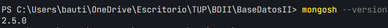
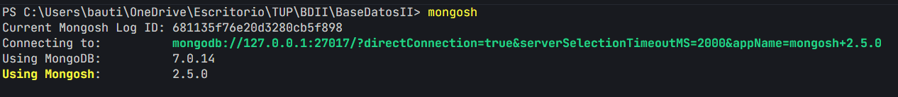

# TP2: MONGODB

[1](#1) [2](#2) [3](#3) [4](#4) [5](#5) [6](#6) [7](#7) [8](#8) [9](#9) [10] (#10)

## 1. 

### Verificar si esta instalado mongodb

```bash
mongod --version
```


### Conectarse a mongodb mediante mongosh

```bash
mongosh
```


### Llamamos la base de datos "empresa"

```bash
use empresa
```

### Creacion de colecciones empleados

```bash
db.createCollection("empleados")
```

### Insertar datos en la coleccion empleados

```bash
db.empleados.insertMany([
    {nombre:'Juani Ignacio', edad: 20, puesto: 'Frontend Developer'},
    {nombre:'Darian', edad: '20', puesto: 'Backend Developer'},
    {nombre:'Bautista', edad: '20', puesto: 'Software Developer'}
]);
```
## Update
### Actualizar la edad del empleado 'Bautista'

```bash
db.empleados.updateOne(
    {nombre: 'Bautista'},
    {$set: {edad: 21}}
);
```


