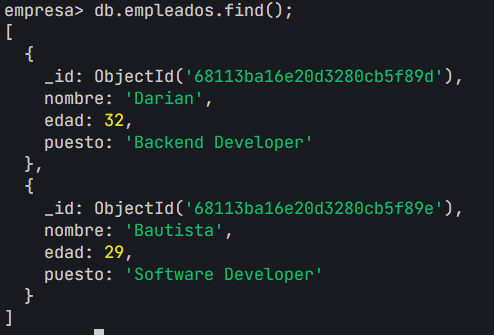
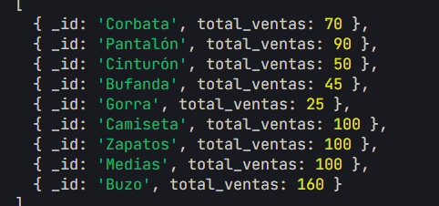

# TP2: MONGODB

[1](#1) [2](#2) [3](#3) [4](#4) [5](#5) [6](#6) [7](#7) [8](#8) [9](#9) [10] (#10)

## 1. CRUD 

#### Verificar si esta instalado mongodb

```bash
mongod --version
```


#### Conectarse a mongodb mediante mongosh

```bash
mongosh
```


#### Llamamos la base de datos "empresa"

```bash
use empresa
```

#### Creacion de colecciones empleados

```bash
db.createCollection("empleados")
```

#### Insertar datos en la coleccion empleados

```bash
db.empleados.insertMany([
    {nombre:'Juani Ignacio', edad: 30, puesto: 'pasante'},
    {nombre:'Darian', edad: 32, puesto: 'Backend Developer'},
    {nombre:'Bautista', edad: 41, puesto: 'Software Developer'}
]);
```
### Update
#### Actualizar la edad del empleado 'Bautista'

```bash
db.empleados.updateOne(
    {nombre: 'Bautista'},
    {$set: {edad: 29}}
);
```

### Delete
#### Eliminar el empleado 'pasante'

```bash
db.empleados.deleteOne(
    {puesto: 'pasante'}
);
```

#### Ver los datos

```bash
db.empleados.find();
```



## 2. Operadores Consulta
#### Consulta todos los empleados cuya edad esté entre 25 y 40 años. Usa operadores relacionales y lógicos.

```bash
db.empleados.find({
    $and: [
        {edad: {$gte: 25}}, // Mayor o igual que 25
        {edad: {$lte: 40}} // Menor o igual que 40
    ]
});
```


## 3. Uso de proyección Recupera los nombres y puestos de todos los empleados, sin mostrar el _id.

```bash
db.empleados.find(
    {}, // Filtro vacío para seleccionar todos los documentos
    { _id: 0, nombre: 1, puesto: 1 } // Proyección para mostrar solo nombre y puesto, excluyendo _id
);
```


## 4. Documentos embebidos Agrega un campo direccion que incluya calle, ciudad y codigo_postal.

```bash
db.empleados.updateMany(
    {}, // Filtro vacío para seleccionar todos los documentos
    { $set: { direccion: { calle: "Guemes", ciudad: "Bahia Blanca", codigo_postal: "8000" } } }
);
```


## 5. Agregar nueva coleccion ventas y calcular el total de ventas por producto usando $group y $sum.

### Crear la coleccion ventas

```bash
db.createCollection("ventas");
```

### Insertar datos en la coleccion ventas

```bash
db.ventas.insertMany([
    {producto: 'Camiseta', cantidad: 5, precio_unitario: 20},
    {producto: 'Pantalón', cantidad: 3, precio_unitario: 30},
    {producto: 'Zapatos', cantidad: 2, precio_unitario: 50},
    {producto: 'Medias', cantidad: 10, precio_unitario: 10},
    {producto: 'Buzo', cantidad: 2, precio_unitario: 80},
    {producto: 'Gorra', cantidad: 5, precio_unitario: 5},
    {producto: 'Bufanda', cantidad: 3, precio_unitario: 15},
    {producto: 'Cinturón', cantidad: 2, precio_unitario: 25},
    {producto: 'Corbata', cantidad: 2, precio_unitario: 35}
]);
```

### Agrupar por producto y calcular el total de ventas por producto

```bash
db.ventas.aggregate([
    { $group: { _id: "$producto", total_ventas: { $sum: { $multiply: ["$cantidad", "$precio_unitario"] } } } }
]);
```



## 6. Crear un índice compuesto sobre los campos apellido y nombre en una colección de clientes.

### crear la coleccion clientes

```bash
db.createCollection("clientes");
```
### Insertar datos en la coleccion clientes

```bash
db.clientes.insertMany([
    {nombre: 'Maria', apellido: 'Perez'},
    {nombre: 'Juan', apellido: 'Perez'},
    {nombre: 'Ana', apellido: 'Gomez'},
    {nombre: 'Pedro', apellido: 'Gomez'},
    {nombre: 'Lucia', apellido: 'Lopez'},
    {nombre: 'Jose', apellido: 'Lopez'}
]);
```

### Crear el indice compuesto

```bash
db.clientes.createIndex({apellido: 1, nombre: 1});
```

### Resultado: 
```bash
apellido_1_nombre_1
```

## 7.  Referencias

###  Crear una db nueva y una colección cursos y alumnos

```bash
use ("universidad");
```

```bash
db.createCollection("cursos");
db.createCollection("alumnos");
```

### Insertar datos en la coleccion cursos con id_curso

```bash
db.cursos.insertMany([
    {id_curso: 1, nombre: 'Programacion'},
    {id_curso: 2, nombre: 'Matematicas'},
    {id_curso: 3, nombre: 'Ingles'},
    {id_curso: 4, nombre: 'Fisica'},
    {id_curso: 5, nombre: 'Quimica'},
    {id_curso: 6, nombre: 'Biologia'}
]);
```

### Insertar datos en la coleccion alumnos con sus cursos

```bash
db.alumnos.insertMany([
    {nombre: 'Juan', apellido: 'Perez', cursos: [1, 2, 3]},
    {nombre: 'Ana', apellido: 'Gomez', cursos: [4, 5, 6]},
    {nombre: 'Pedro', apellido: 'Lopez', cursos: [1, 3, 5]},
    {nombre: 'Lucia', apellido: 'Martinez', cursos: [2, 4, 6]},
    {nombre: 'Jose', apellido: 'Sanchez', cursos: [1, 2, 3, 4, 5, 6]}
]);
```

### Resultado:

```bash
[
  {
    _id: ObjectId('681144a76e20d3280cb5f8bf'),
    nombre: 'Juan',
    apellido: 'Perez',
    cursos: [ 1, 2, 3 ]
  },
  {
    _id: ObjectId('681144a76e20d3280cb5f8c0'),
    nombre: 'Ana',
    apellido: 'Gomez',
    cursos: [ 4, 5, 6 ]
  },
  {
    _id: ObjectId('681144a76e20d3280cb5f8c1'),
    nombre: 'Pedro',
    apellido: 'Lopez',
    cursos: [ 1, 3, 5 ]
  },
  {
    _id: ObjectId('681144a76e20d3280cb5f8c2'),
    nombre: 'Lucia',
    apellido: 'Martinez',
    cursos: [ 2, 4, 6 ]
  },
  {
    _id: ObjectId('681144a76e20d3280cb5f8c3'),
    nombre: 'Jose',
    apellido: 'Sanchez',
    cursos: [ 1, 2, 3, 4, 5, 6 ]
  }
]
```

## 8. Realizar una agregación donde se combinen los datos de alumnos y cursos usando $lookup.
```bash
db.alumnos.aggregate([
    {
        $lookup: {
            from: "cursos",
            localField: "cursos",
            foreignField: "id_curso",
            as: "cursos_info"
        }
    }
]);
```
<details>
<summary>Click to view results of $lookup aggregation: 
    [
  {
    _id: ObjectId('681144a76e20d3280cb5f8bf'),
    nombre: 'Juan',
    apellido: 'Perez',
    cursos: [ 1, 2, 3 ],
    cursos_info: [
      {
        _id: ObjectId('681144896e20d3280cb5f8b9'),
        id_curso: 1,
        nombre: 'Programacion'
      },
      {
        _id: ObjectId('681144896e20d3280cb5f8ba'),
        id_curso: 2,
        nombre: 'Matematicas'
      },
      {
        _id: ObjectId('681144896e20d3280cb5f8bb'),
        id_curso: 3,
        nombre: 'Ingles'
      }
    ]
  },
  {
    _id: ObjectId('681144a76e20d3280cb5f8c0'),
    nombre: 'Ana',
    apellido: 'Gomez',
    cursos: [ 4, 5, 6 ],
    cursos_info: [
      {
        _id: ObjectId('681144896e20d3280cb5f8bc'),
        id_curso: 4,
        nombre: 'Fisica'
      },
      {
        _id: ObjectId('681144896e20d3280cb5f8bd'),
        id_curso: 5,
        nombre: 'Quimica'
      },
      {
        _id: ObjectId('681144896e20d3280cb5f8be'),
        id_curso: 6,
        nombre: 'Biologia'
      }
    ]
  },
  {
    _id: ObjectId('681144a76e20d3280cb5f8c1'),
    nombre: 'Pedro',
    apellido: 'Lopez',
    cursos: [ 1, 3, 5 ],
    cursos_info: [
      {
        _id: ObjectId('681144896e20d3280cb5f8b9'),
        id_curso: 1,
        nombre: 'Programacion'
      },
      {
        _id: ObjectId('681144896e20d3280cb5f8bb'),
        id_curso: 3,
        nombre: 'Ingles'
      },
      {
        _id: ObjectId('681144896e20d3280cb5f8bd'),
        id_curso: 5,
        nombre: 'Quimica'
      }
    ]
  },
  {
    _id: ObjectId('681144a76e20d3280cb5f8c2'),
    nombre: 'Lucia',
    apellido: 'Martinez',
    cursos: [ 2, 4, 6 ],
    cursos_info: [
      {
        _id: ObjectId('681144896e20d3280cb5f8ba'),
        id_curso: 2,
        nombre: 'Matematicas'
      },
      {
        _id: ObjectId('681144896e20d3280cb5f8bc'),
        id_curso: 4,
        nombre: 'Fisica'
      },
      {
        _id: ObjectId('681144896e20d3280cb5f8be'),
        id_curso: 6,
        nombre: 'Biologia'
      }
    ]
  },
  {
    _id: ObjectId('681144a76e20d3280cb5f8c3'),
    nombre: 'Jose',
    apellido: 'Sanchez',
    cursos: [ 1, 2, 3, 4, 5, 6 ],
    cursos_info: [
      {
        _id: ObjectId('681144896e20d3280cb5f8b9'),
        id_curso: 1,
        nombre: 'Programacion'
      },
      {
        _id: ObjectId('681144896e20d3280cb5f8ba'),
        id_curso: 2,
        nombre: 'Matematicas'
      },
      {
        _id: ObjectId('681144896e20d3280cb5f8bb'),
        id_curso: 3,
        nombre: 'Ingles'
      },
      {
        _id: ObjectId('681144896e20d3280cb5f8bc'),
        id_curso: 4,
        nombre: 'Fisica'
      },
      {
        _id: ObjectId('681144896e20d3280cb5f8bd'),
        id_curso: 5,
        nombre: 'Quimica'
      },
      {
        _id: ObjectId('681144896e20d3280cb5f8be'),
        id_curso: 6,
        nombre: 'Biologia'
      }
    ]
  }
]
</summary>

